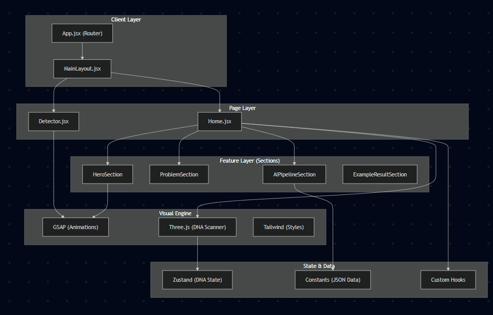
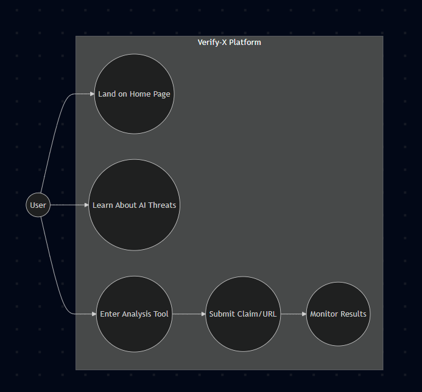
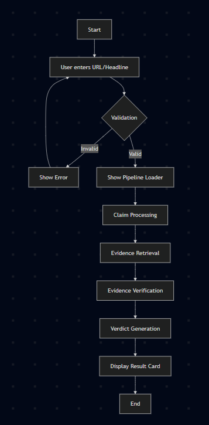
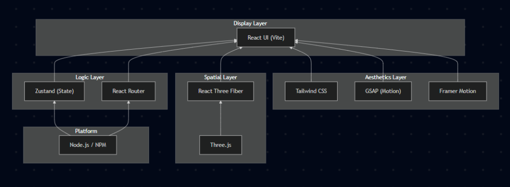

# Verify-X Diagram Gallery

This file provides a quick visual reference for all system design diagrams.

---

## 🏗️ 1. Overall System Architecture

---

## 👥 2. User Use-Case Flow

---

## ⚡ 3. Verification Activity Flow

---

## 🛠️ 4. Technical Solution Stack

